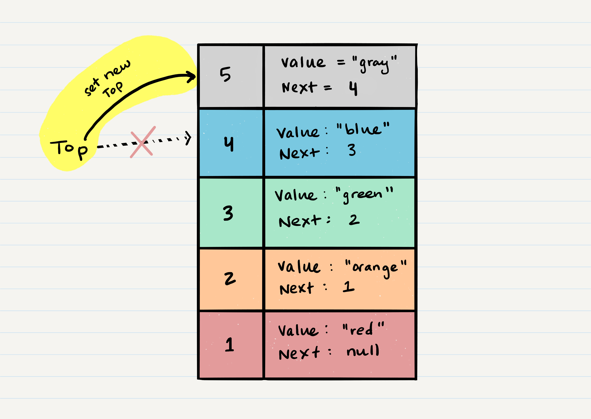

# Stacks and Queues
## Stack
A stack is a data structure that consists of Nodes. Each Node references the next Node in the stack, but does not reference its previous.

Common terminology for a stack is

- Push - Nodes or items that are put into the stack are pushed
- Pop - Nodes or items that are removed from the stack are popped. When you attempt to pop an empty stack an exception will be raised.
- Top - This is the top of the stack.
- Peek - When you peek you will view the value of the top Node in the stack. When you attempt to peek an empty stack an exception will be raised.
- IsEmpty - returns true when stack is empty otherwise returns false.

Stacks follow these concepts:

**FILO**
**First In Last Out**

This means that the first item added in the stack will be the last item popped out of the stack.

**LIFO**
**Last In First Out**

This means that the last item added to the stack will be the first item popped out of the stack.

Stack Visualization
Here’s an example of what a stack looks like. As you can see, the topmost item is denoted as the top. When you push something to the stack, it becomes the new top. When you pop something from the stack, you pop the current top and set the next top as top.next.


Push O(1)

Pushing a Node onto a stack will always be an O(1) operation. This is because it takes the same amount of time no matter how many Nodes (n) you have in the stack.

When adding a Node, you push it into the stack by assigning it as the new top, with its next property equal to the original top



Here is the pseudocode to push a value onto a stack:
```
ALOGORITHM push(value)
// INPUT <-- value to add, wrapped in Node internally
// OUTPUT <-- none
   node = new Node(value)
   node.next <-- Top
   top <-- Node
```


Pop O(1)

Popping a Node off a stack is the action of removing a Node from the top. When conducting a pop, the top Node will be re-assigned to the Node that lives below and the top Node is returned to the user.

Typically, you would check isEmpty before conducting a pop. This will ensure that an exception is not raised. Alternately, you can wrap the call in a try/catch block.


Here is the pseudocode for a pop

```
ALGORITHM pop()
// INPUT <-- No input
// OUTPUT <-- value of top Node in stack
// EXCEPTION if stack is empty

   Node temp <-- top
   top <-- top.next
   temp.next <-- null
   return temp.value
```


## Queue
Common terminology for a queue is

- Enqueue - Nodes or items that are added to the queue.
- Dequeue - Nodes or items that are removed from the queue. If called when the queue is empty an exception will be raised.
- Front - This is the front/first Node of the queue.
- Rear - This is the rear/last Node of the queue.
- Peek - When you peek you will view the value of the front Node in the queue. If called when the queue is empty an exception will be raised.
- IsEmpty - returns true when queue is empty otherwise returns false.
Queues follow these concepts:

**FIFO**
**First In First Out**

This means that the first item in the queue will be the first item out of the queue.

**LILO**
**Last In Last Out**

This means that the last item in the queue will be the last item out of the queue.


Queue Visualization

Here is what a Queue looks like:


Enqueue O(1)

When you add an item to a queue, you use the enqueue action. This is done with an O(1) operation in time because it does not matter how many other items live in the queue (n); it takes the same amount of time to perform the operation.


Here is the pseudocode for the enqueue method:
```
ALGORITHM enqueue(value)
// INPUT <-- value to add to queue (will be wrapped in Node internally)
// OUTPUT <-- none
   node = new Node(value)
```

Dequeue O(1)

When you remove an item from a queue, you use the dequeue action. This is done with an O(1) operation in time because it doesn’t matter how many other items are in the queue, you are always just removing the front Node of the queue.

Typically, you would check isEmpty before conducting a dequeue. This will ensure that an exception is not raised. Alternately, you can wrap the call in a try/catch block.


Here is the pseudocode for the dequeue method:

```
ALGORITHM dequeue()
// INPUT <-- none
// OUTPUT <-- value of the removed Node
// EXCEPTION if queue is empty

   Node temp <-- front
   front <-- front.next
   temp.next <-- null

   return temp.value
```


resources

[Stacks and Queues](https://codefellows.github.io/common_curriculum/data_structures_and_algorithms/Code_401/class-10/resources/stacks_and_queues.html)