## SQL Reading notes 

SQLBOLT is really useful website i learned a lot of sql language .
i learned about Queries the SELECT ,UPDATE ,DELETE ,INSERT
and solve the Exercises was intresting .

```
SELECT title, year FROM movies; 
```
```
INSERT INTO boxoffice VALUES (4, 8.7, 340000000, 270000000);
```
```
UPDATE movies
SET director = "John Lasseter"
WHERE id = 2;
```
```
DELETE FROM movies
where year < 2005;
```

And using constraints like 
NOT ,LIKE ,IN ,NOT IN ,BETWEEN … AND …

```
SELECT title, year FROM movies
WHERE year BETWEEN 2000 AND 2010;
```
```
SELECT title, year FROM movies
WHERE year < 2000 OR year > 2010;
```
```
SELECT title, director FROM movies 
WHERE title LIKE "Toy Story%";
```

Sorting and filtering like 

```
SELECT DISTINCT director FROM movies
ORDER BY director ASC;
```

```
SELECT title, year FROM movies
ORDER BY year DESC
LIMIT 4;
```

```
SELECT title FROM movies
ORDER BY title ASC
LIMIT 5 OFFSET 2;
```

Creating and dropes  tables 
and Altering tables 

```
ALTER TABLE Movies
  ADD COLUMN Aspect_ratio FLOAT DEFAULT 2.39;
```

```
ALTER TABLE Movies
  DROP Length_minutes ;
```

```
CREATE TABLE Database (
    Name TEXT,
    Version FLOAT,
    Download_count INTEGER
);
```

And joining tables 
```
SELECT title, domestic_sales, international_sales 
FROM movies
  JOIN boxoffice
    ON movies.id = boxoffice.movie_id;
```

Here is screenshots for the exercises 

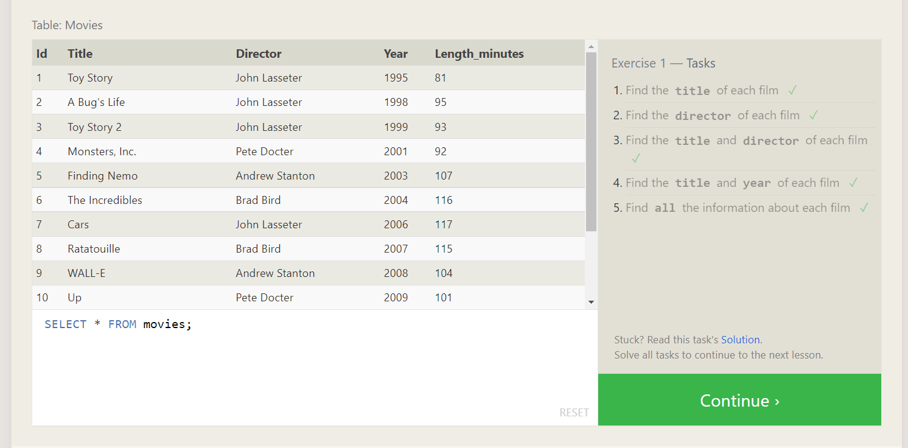
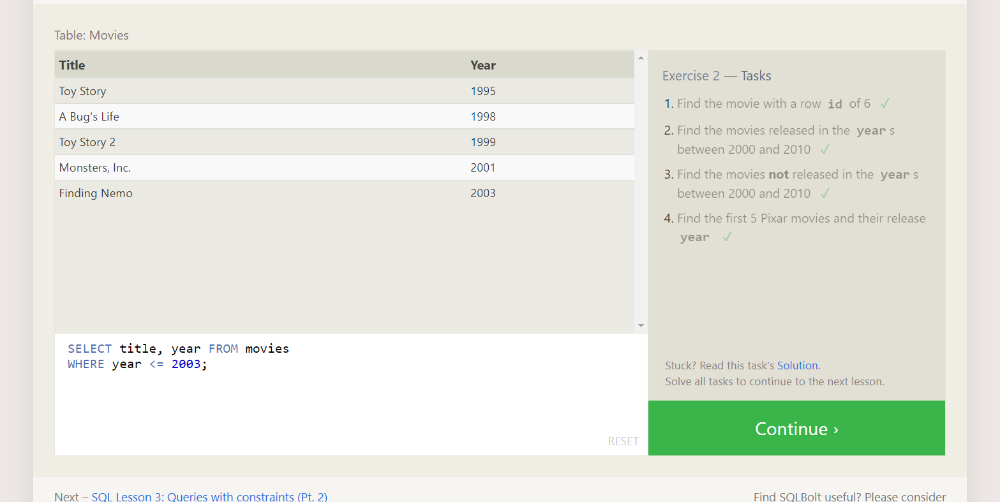
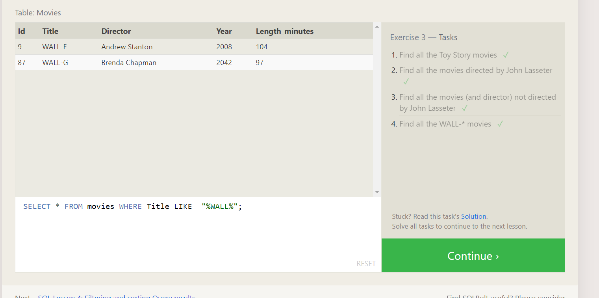
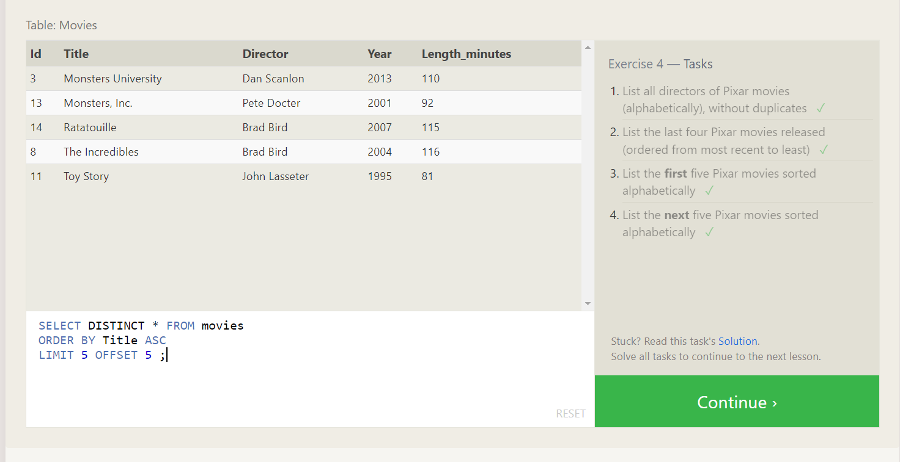
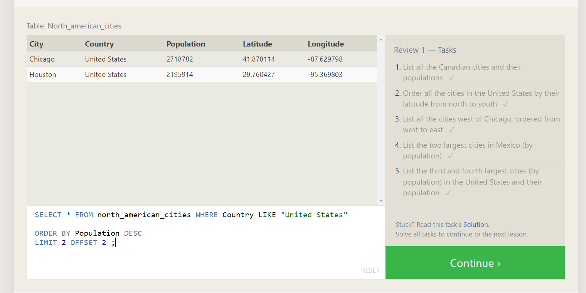
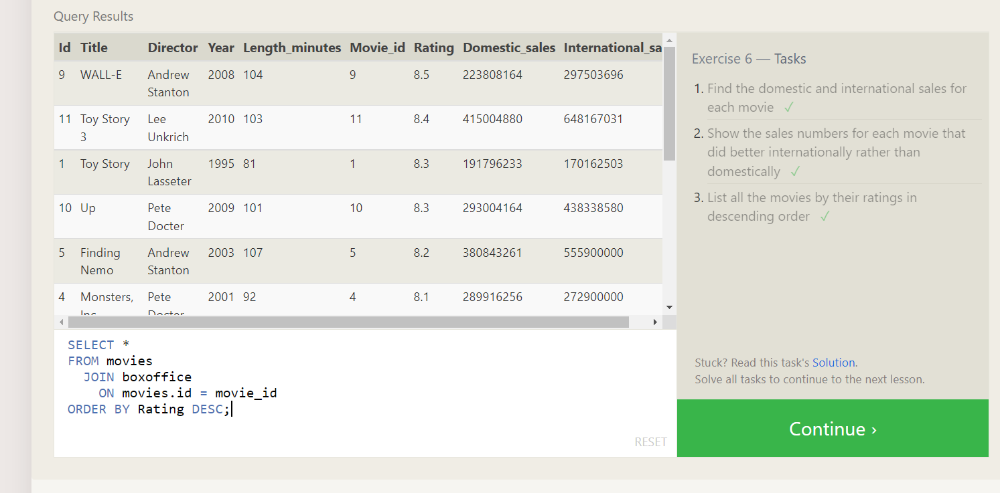
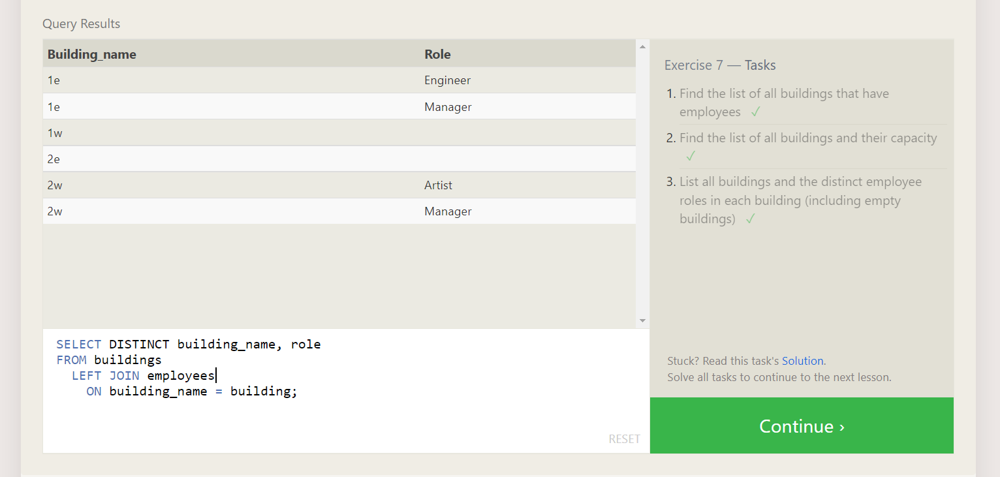
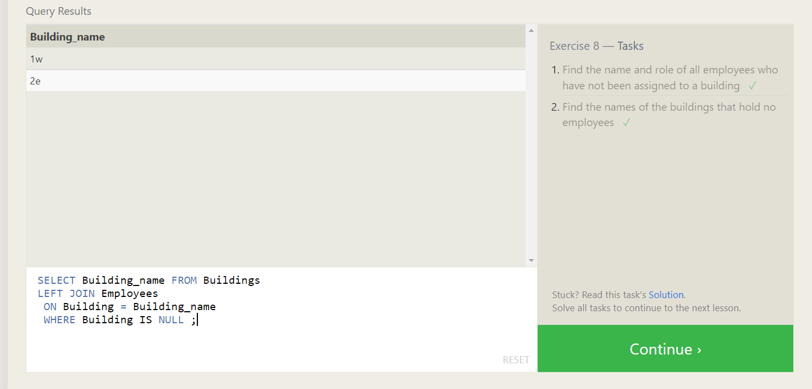
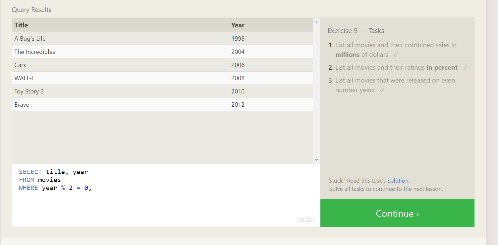
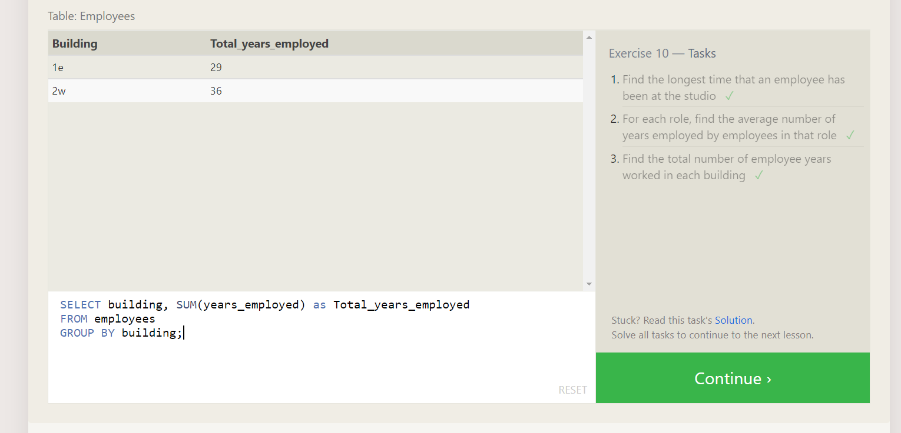
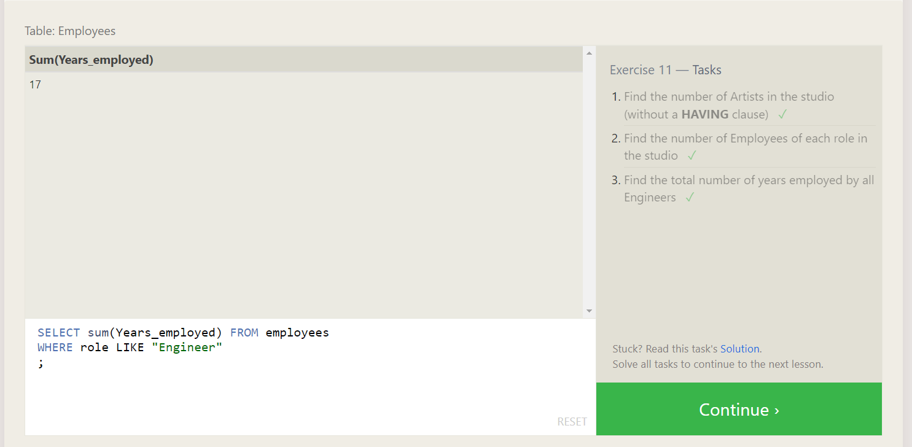
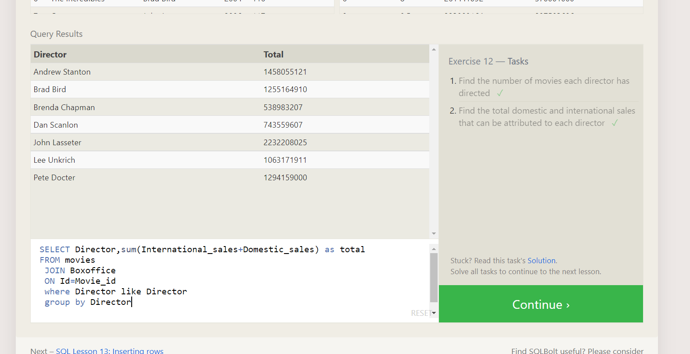
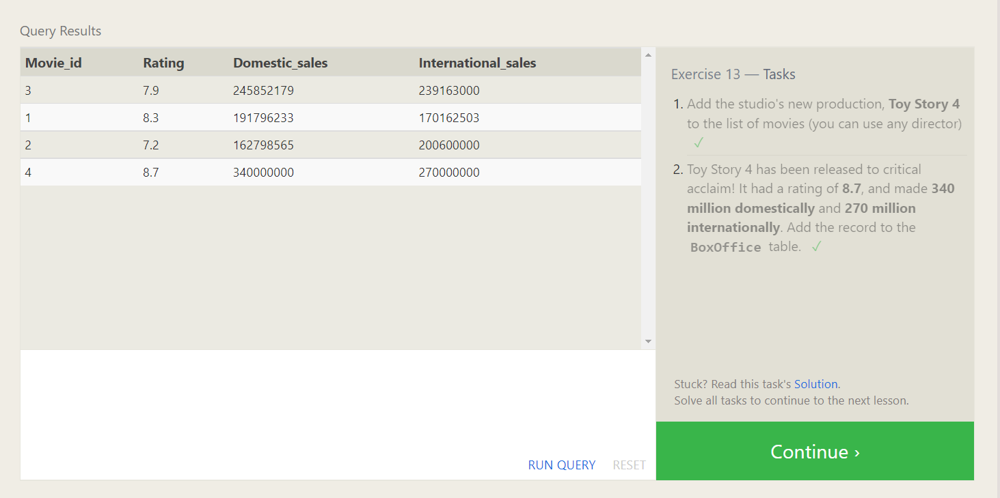
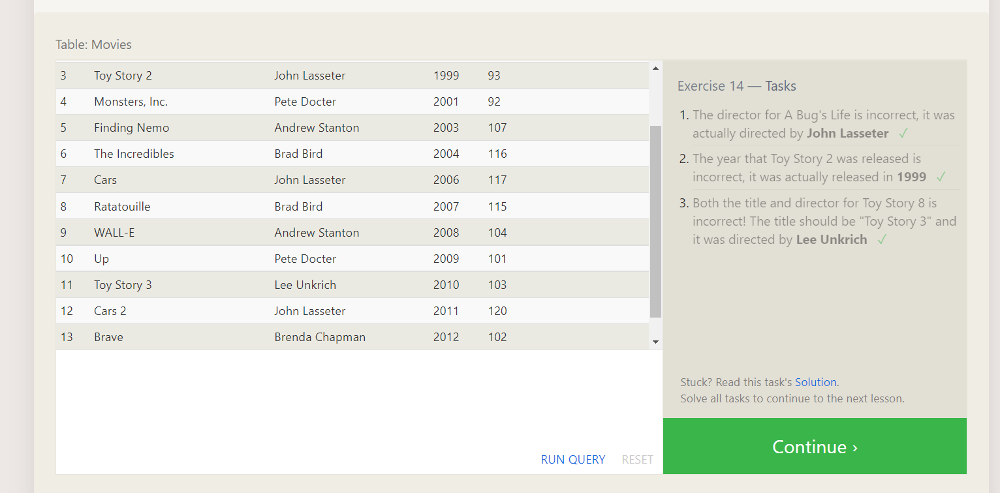
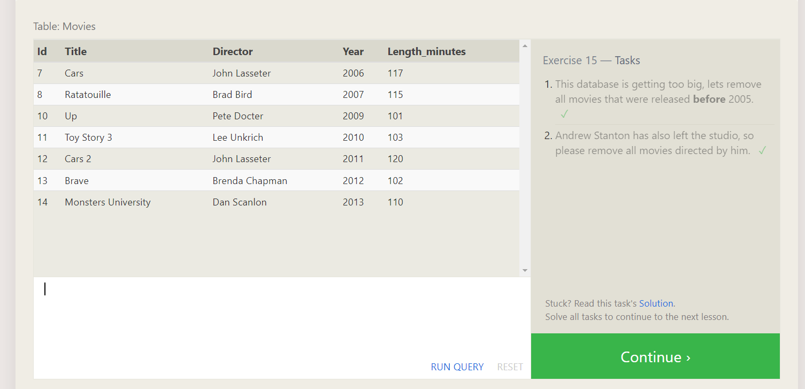
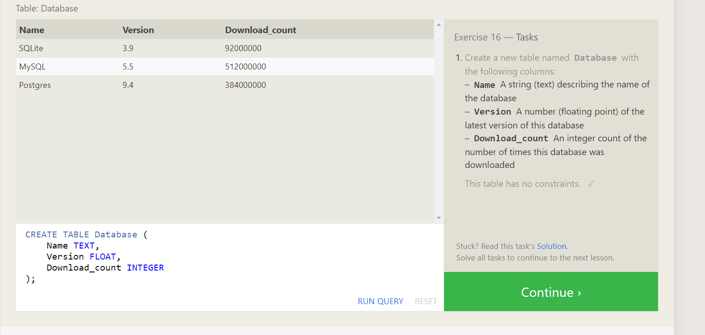
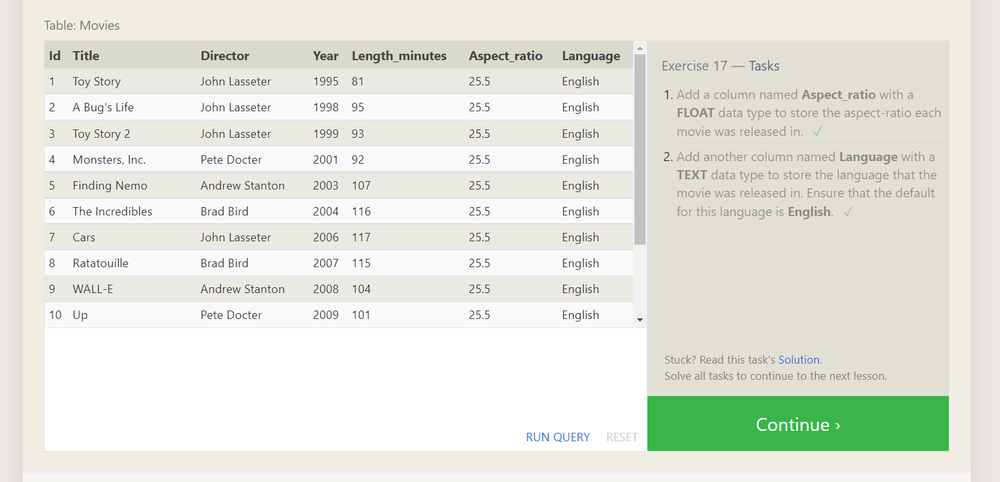
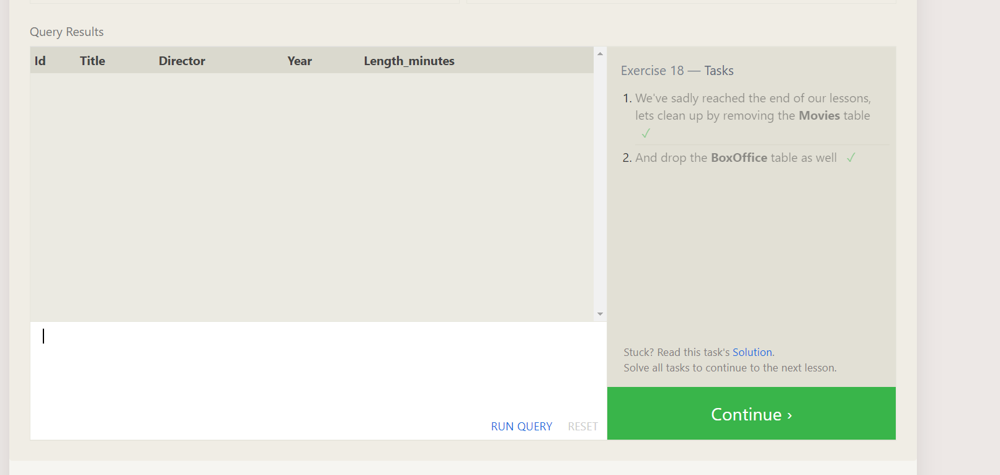